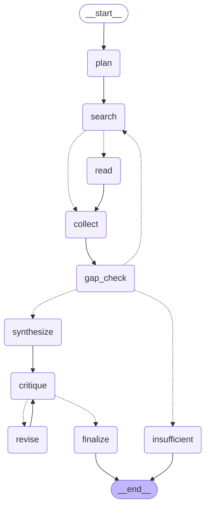

# Architecture

## Pipeline

Generated from the compiled graph, so it cannot drift from the code:

```bash
python -c "from deepresearch.graph import build_graph; print(build_graph().get_graph().draw_mermaid())"
```



Dotted edges are conditional (router functions); solid edges are unconditional.

Reading it: `search` fans out one `read` branch per source via `Send`, `collect` joins them and
assigns citation ids, `gap_check` decides whether another round is warranted, and `critique`
loops with `revise` until the report is approved or the revision cap is hit. `insufficient` is
the terminal path taken when no usable evidence was found.

`read` and `critique` carry the grounding guarantees; the rest is plumbing around them.

## Component responsibilities

| Module | Kind | Responsibility |
|---|---|---|
| `graph.py` | orchestration | LangGraph nodes, routers, `Send` fan-out, checkpointing |
| `report.py` | assembly | Markdown, sources section, reviewer note (pure functions) |
| `agents/planner.py` | LLM | Question → sub-questions + search queries |
| `agents/searcher.py` | **deterministic** | Search, dedupe, embedding-rank URL selection |
| `agents/reader.py` | LLM | Page → findings tied to verbatim passages |
| `agents/gap_analyst.py` | LLM | Coverage audit → follow-up queries or `done` |
| `agents/synthesizer.py` | LLM | Findings → structured Markdown report |
| `agents/critic.py` | **hybrid** | Regex id validation + LLM support checking |
| `llm.py` | infra | Provider fallback, backoff, token ledger |
| `tools/search.py` | infra | Provider fallback, cache, global search budget |
| `tools/fetch.py` | infra | HTTP + boilerplate removal, cache, failure isolation |
| `tools/rank.py` | infra | Chunking, ONNX embeddings, TF-IDF fallback |
| `models.py` | contracts | Pydantic schemas + `SourceRegistry` |

## Design decisions

### 1. Citations are verifiable, not asserted

The Reader never writes a quote. It receives passages labelled `P1..P5` extracted verbatim
from the page and must cite those labels. Python maps `P#` onto run-global `S#` ids and stores
the exact text in a `SourceRegistry`.

This means a fabricated citation is **mechanically detectable**: `critic.py` regexes every
`[S#]` out of the draft and checks it against the registry before any model sees it. The
semantic question — *does this passage actually support this sentence?* — is a separate, later
LLM pass. Cheap deterministic check first, expensive judgement second.

### 2. Retrieval instead of context stuffing

A fetched page routinely exceeds 50k tokens. Rather than truncating (which silently discards
evidence) or paying for a long-context model, pages are chunked with overlap, embedded locally
via ONNX, and only the top-5 passages relevant to the current sub-question reach the model.
A large page costs roughly 800 prompt tokens.

Local embeddings also mean retrieval has no rate limit and no marginal cost — the two things
that actually constrain a free-tier build.

### 3. No LLM where maths suffices

`searcher.py` picks which URLs to read using cosine similarity over title+snippet embeddings.
An LLM call there would be slower, consume free-tier budget, and rank no better. Models are
used for judgement; deterministic code is used for everything else.

### 4. Failure is a designed state, not an exception

| Failure | Handling |
|---|---|
| Rate limit (429) | Obey the provider's stated retry window, then walk the fallback chain |
| Zero-quota project | Classified as permanent, skipped without retrying |
| Malformed JSON | One re-prompt carrying the validation error, then a typed safe default |
| Dead / paywalled URL | `fetch_text` returns `None`; that source is skipped |
| Embedding model unavailable | Transparent fallback to numpy TF-IDF ranking |
| No evidence found | Explicit "insufficient evidence" report — never a fabricated answer |

Degradations are recorded in `ResearchState.notes` and printed under `--verbose`, so a partial
run is visibly partial rather than quietly wrong.

## Service layer

`src/backend/` wraps the pipeline in FastAPI — an app factory in `main.py`, handlers grouped by
resource under `routers/`, and the job queue in `services/jobs.py`. `src/frontend/` is the
Streamlit UI, with every HTTP call confined to `api_client.py` and the screen split into
`components/`. The frontend talks to the API over HTTP rather than importing `deepresearch`,
so the service boundary is real rather than decorative.

### Runs are serialised, deliberately

`api/jobs.py` is a single-worker queue. Two reasons, and the ordering matters:

1. The pipeline holds its progress callback, token ledger, search budget and limiter state in
   module globals. Concurrent runs in one process would interleave and corrupt each other.
2. **Even with that fixed**, free-tier providers cannot sustain two concurrent research runs —
   they would rate-limit each other into failure.

Reason 2 is the real one, which is why the fix is a queue rather than a refactor.
`graph.run_research` also takes a process-wide lock, so the invariant holds even for direct
library callers rather than resting on the API's good behaviour. Queue position is reported to
the client instead of the request silently starving.

### Long work behind a short request

A run takes minutes, so `POST /research` enqueues and returns `202` with a run id. Progress is
Server-Sent Events; the finished report is fetched separately. No endpoint blocks on the
pipeline.

Two details that matter more than they look:

- **Every run ends with an explicit `done` or `error` event.** A stream that merely stops is
  indistinguishable from a hung backend — the same "silence is not success" failure that made
  the early CLI runs so hard to diagnose.
- **A late subscriber gets the full history replayed**, so opening the UI mid-run shows the
  whole feed rather than starting blank.

Idle streams emit a keep-alive comment every 15 seconds, because a slow node can otherwise
leave a proxy convinced the connection is dead.

## Failures found by running it

The reliability design above is not all foresight. Four things were wrong in ways that only
appeared under a real workload, and each changed the architecture.

### The fallback chain walks models before providers

The original design was Groq → Gemini, on the reasoning that a second *provider* sits in a
separate rate-limit bucket. Under load this turned out to be the wrong axis: Groq enforces
limits **per model**, so exhausting `llama-3.3-70b`'s tokens-per-minute window leaves
`gpt-oss-120b` and `llama-3.1-8b` completely untouched.

The chain is now four deep — three Groq models, then Gemini — and switching model is both
cheaper and far more likely to succeed than switching provider. `config.GROQ_MODELS` is
ordered strongest-first, so quality degrades gradually rather than falling off a cliff.

### Retry hints are parsed, not guessed

Backoff started as textbook exponential: 2s, 4s, 8s. Then a real 429 arrived carrying
`Please retry in 37.4s`, and a second one `try again in 1m6.599s`. Against a
tokens-per-minute window, every one of those short sleeps is *guaranteed* to fail — the
provider had already said exactly how long the window was.

`_retry_after_seconds` now reads the `retry-after` header and three distinct message formats
(Gemini's `retryDelay: "46s"`, Groq's `try again in 8.5s`, and Groq's compound `2m30s`),
falling back to exponential only when no hint is present.

### A zero quota is not congestion

`limit: 0` in a quota error means the project has *no* free-tier allowance for that model and
never will. Treating it as a normal 429 burned three backoff sleeps per call before failing
over. It is now classified as non-retryable, so the chain moves on immediately.

### ONNX inference is not thread-safe

The reader fans out across a thread pool, and each thread calls `rank.top_k`, which calls
`fastembed`. That combination crashes the interpreter with `double free or corruption` — a
heap corruption in native code, not a catchable Python exception, so none of the error
handling above could have saved it.

Embedding calls are now serialised behind `_INFERENCE_LOCK`. This costs almost nothing:
inference is a few milliseconds, while the network I/O the threads exist to overlap is
measured in seconds. Regression test: 120 concurrent `top_k` calls across 8 threads.

**The general lesson**, and the one worth repeating in an interview: the failure modes that
actually broke this system were not the ones anticipated in the design. Provider docs
under-describe rate limiting, and a C-extension crash bypasses every `try/except` in the
codebase. Reliability work has to be driven by observed failures, not imagined ones.

### 5. Every loop is bounded

`MAX_RESEARCH_ROUNDS`, `MAX_CRITIC_REVISIONS`, `MAX_SEARCHES_TOTAL`, `MAX_SUBQUESTIONS`, and
`MAX_URLS_PER_SUBQUESTION` all live in `config.py`. The search budget is enforced inside
`tools/search.py` rather than by callers, so it cannot be bypassed by a new code path.

### 6. Threads, not async

Fan-out uses `ThreadPoolExecutor` capped at `MAX_WORKERS = 3`. The work is I/O-bound, two
vendor SDKs are involved, and the cap doubles as rate-limit protection. Async would add two
concurrency models and no throughput.

## Why LangGraph — and why it was not there first

The orchestrator started as ~40 lines of explicit control flow in a hand-written
`supervisor.py`, and the argument for it was sound: the flow is two cycles and a branch, a
graph DSL does not make that clearer, and a framework puts indirection between a loop bound
and the code enforcing it.

That argument was about *expressiveness*, and it was answering the wrong question. The thing
that broke this system was **durability**. Under free-tier rate limits, runs began dying at the
Critic — the final node — and discarding planning, two research rounds, dozens of findings and
a complete draft. Twenty minutes of correct work thrown away because state lived in memory.

No amount of clean loop-writing fixes that. Checkpointing does.

### What the migration bought

| | Hand-written loop | LangGraph |
|---|---|---|
| Crash mid-run | All work lost | Resumes from last completed node |
| Fan-out failure | Whole round lost | One source lost |
| Progress inspection | Log lines only | Queryable checkpoint state |
| Diagram | Hand-drawn, drifts | `graph.get_graph().draw_mermaid()` |

### What it cost

- `langgraph` pulls `langchain-core` and a checkpoint stack — a large dependency increase for
  a project whose selling point was that it had almost none
- Control flow is now spread across router functions rather than readable top-to-bottom
- Cycles need explicit terminal branches; an unbounded cycle is easier to write by accident
  than an unbounded `for` loop, so every router carries a cap plus a global run deadline

### Two things the graph forced us to get right

**Citation ids cannot be allocated during fan-out.** Parallel `Send` branches sharing a global
counter would both hand out `[S5]`. Each read therefore gets a private `SourceRegistry`, and
`collect` renumbers by job index once the fan-out joins. Ids now depend on the work rather than
on thread scheduling — which also means a resumed run reproduces the same citations.

**State must serialise.** The original `ResearchState` carries `threading.Lock` objects and a
registry, none of which can be checkpointed. Rather than rewrite six agents, the graph state is
plain data and each node hydrates a `ResearchState` from it via
`ResearchState.from_graph_state`. **No agent changed during the migration** — the payoff for
having had typed contracts between them from the start.
